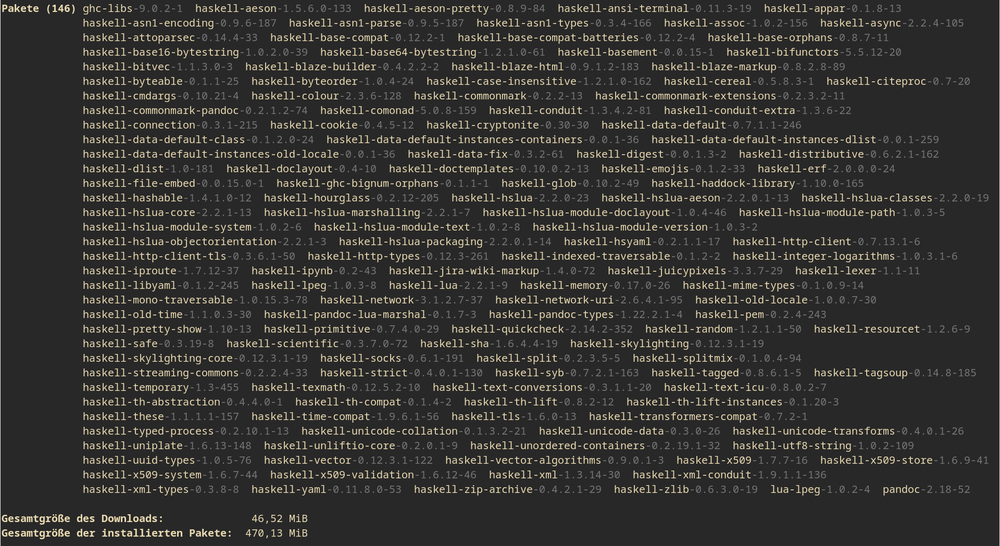

# md2latex

**md2latex** is a simple (and perhaps very primitive) Markdown to Latex compiler. Currently in early development.

## But why?

Write your thesis in Markdown! Or perhaps something else, idk.

### What about pandoc?

Pandoc does the job too, and it is more advanced, but take a look at the number of dependencies:

So many dependencies scare me!

## Build

Type `make`.

## Usage

Coming soon™.
